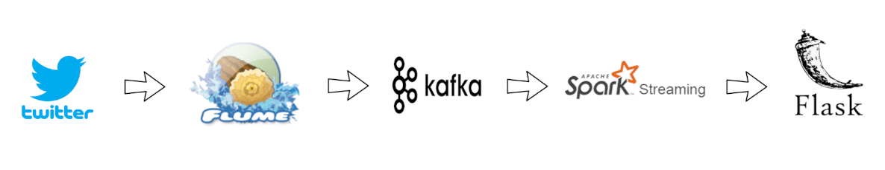

# Real-time Twitter Data Analysis using Flume, Kafka and Spark

## Authors
*  :man_technologist: **Vipul Tiwari**
*  :woman_technologist: **Roline Stapny Saldanha**
*  :man_technologist: **Devi Sandeep Endluri**
*  :man_technologist: **Kartik Venkataraman**
*  :woman_technologist: **Manseerat Batra**

## Architecture
<h3 align="center">
  
</h3>

**Flume:** Flume is used to connect to twitter and get the streaming data. Then, this data is cleaned and sent to Kafka.

**Kafka:** This holds the messages for consumption by Spark.

**Spark Streaming:** Consumes the messages from Kafka and process them, and sends them to Flask server.

**Flask:** Python web framework, which receives the data from Spark and shows dashboards.

## Dashboard
<h3 align="center">
  
</h3>

## Instructions
Needed packages:

Install all the packages from requirements.txt

Kafka:

1.  Go to the Kafka directory.
2.  Run zookeeper using command: nohup bin/zookeeper-server-start.sh config/zookeeper.properties > ~/zookeeper-logs &
3.  Run Kafka using the command: nohup bin/kafka-server-start.sh config/server.properties > ~/kafka-logs &

Flume:

1.  Go to the Flume directory (For example, cd apache-flume-1.9.0-bin/)
2.  Run flume agent using the command: bin/flume-ng agent --conf conf --conf-file "/home/ubuntu/flume_twitter_to_kafka.conf" --name agent1

Spark streaming:

1.  Download [spark-streaming](https://spark.apache.org/downloads.html) version 2.4.5 
2.  Unzip the tar file in the local workspace.
3.  Set this directory path as SPARK_HOME in environmental variables.
4.  Set the same path as HADOOP_HOME in environmental variables.
5.  Add SPARK_HOME/bin to the PATH variable.
6.  Make sure JAVA_HOME is set to JDK version 1.8
7.  Download the spark-streaming-kafka-assembly_2.11-1.6.0.jar file in this project to the local workspace
8.  Use the following example command to run: bin\spark-submit --jars spark-streaming-kafka-assembly_2.11-1.6.0.jar D:\Spring2020\csce678\project\code\cloudproject\SparkStreaming\spark-kafka.py 3.22.26.9:9092 twitter_stream_new D:\Spring2020\csce678\project\code\cloudproject\geo_tweets.txt

Flask:

1.  Run the flask.rc file in this project (source flask.rc)
2.  Run "flask run", this starts the application by default in localhost:5000
