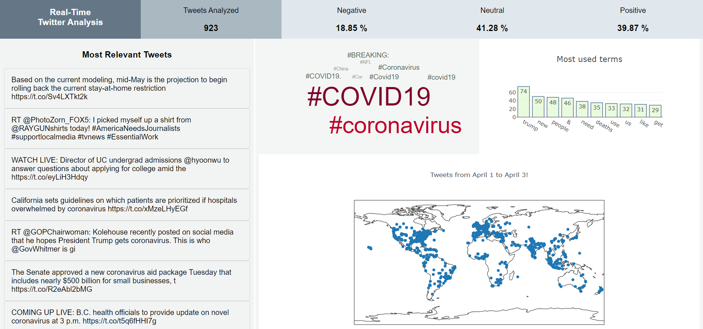

## Authors
* **Vipul Tiwari**
* **Roline Stapny Saldanha**
* **Devi Sandeep Endluri**
* **Kartik Venkataraman**
* **Manseerat Batra**

## Dashboard
<h3 align="center">
  
</h3>

## Instructions
Spark streaming:

1. Download spark-streaming version 2.4.5 from https://spark.apache.org/downloads.html
2. Unzip the tar file in the local workspace.
3. Set this directory path as SPARK_HOME in environmental variables.
4. Set the same path as HADOOP_HOME in environmental variables.
5. Add SPARK_HOME/bin to the PATH variable.
6. Make sure JAVA_HOME is set to JDK version 1.8
7. Install nltk and kafka-python (pip install nltk and pip install kafks-python)
8. Install plotly
9. Download the spark-streaming-kafka-assembly_2.11-1.6.0.jar file in this project to the local workspace
10. Use the following command to run now: bin\spark-submit --jars spark-streaming-kafka-assembly_2.11-1.6.0.jar D:\Spring2020\csce678\project\code\cloudproject\SparkStreaming\spark-kafka.py 3.22.26.9:9092 twitter_stream_new D:\Spring2020\csce678\project\code\cloudproject\geo_tweets.txt

Flask:

1. Install flask (pip install flask)
2. Run the flask.rc file in this project (source flask.rc)
3. Run "flask run", this starts the application by default in localhost:5000
